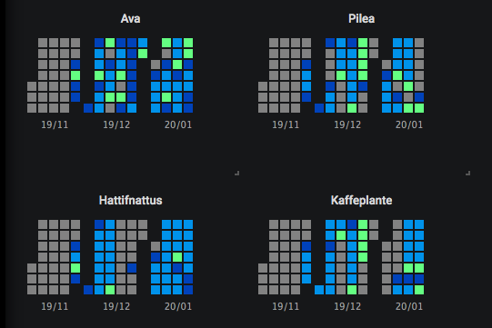

# Plant tracker for Home Assistant

This is a simple appdaemon solution to keep track of when you need to water your plants. Basically a habit tracker for watering your plants with AppDeamon and Home Assistant. No plants died during the making of Plant tracker.

This is an example of how I use the script together with [Button Card by RomRider]([https://github.com/custom-cards/button-card](https://github.com/custom-cards/button-card) (the colors represent the four different tracker states. The numbers are the days since the plant was watered). 


Plant infromation:


*What the PlantTracker.py does:*

The script creates a sensor for each plant you want to track. The sensor has four states: 3 (the plant was watered today), 2 (the plant does not need water), 1 (the plant should be checked), 0 (the plant needs water). The states are calculated every day at a chosen time (0:05 by default) and when the "last watered date" is changed (for example when you water the plant). 

The script also stores the "last watered date" in a file so that the states are retained after a restart.

## Setup

Add PlantTracker.py to your AppDaemon apps path (ex. /config/appdaemon/apps/). You will have to set up the script in AppDeamon and add all the plants you want to track in the configuration file (apps.yaml).

Options for each plant:

- watering_interval (required): Interval between watering
- friendly_name (optional)
- last_watered (optional), format: YYYY/MM/DD (if you want to set a date at init. The date can also be changed maually in developer tools > states)(default:today)
- icon (optional)
- watering_window (optional): How many days to stay in state 1 (should be watered). (default: 1)

A path to the file where the script keeps the "last watered dates" is also needed. The path below works for me on hass.io.

Example content in apps.yaml

```
plant_tracker:
  module: PlantTracker
  class: PlantTracker
  file: /config/appdaemon/apps/plants.db 
plants:
  ava:
    friendly_name: Ava
    watering_interval: 4
    icon: mdi:leaf
    watering_window: 3
  pilea:
    friendly_name: Pilea 
    watering_interval: 7
    icon: mdi:leaf
    watering_window: 4
```

## Helper script

You will have to add some way of updating the "last watered date" from Home Assistant. One way to do this is to [enable python scripts]([https://www.home-assistant.io/integrations/python_script/](https://www.home-assistant.io/integrations/python_script/) and add "water.py" to the python scripts folder. This script updates the date for the plant to today. The script can then be called any way you want. I do this from the button card.

## Button card

This is my template setup for the [Button Card](%5Bhttps://github.com/custom-cards/button-card%5D(https://github.com/custom-cards/button-card) in lovelace:

```
button_card_templates:
  plant:
    custom_fields:
      days_since_watered: '[[[return entity.attributes.days_since_watered]]]'
    double_tap_action:
      action: call-service
      service: python_script.water
      service_data:
        entity: '[[[return entity.entity_id]]]'
    hold_action:
      action: call-service
      service: python_script.water
      service_data:
        entity: '[[[return entity.entity_id]]]'
    icon: '[[[return entity.attributes.icon]]]'
    state:
      - color: 'rgb(30,144,255)'
        value: '3'
      - color: 'rgb(0, 128, 0)'
        value: '2'
      - color: 'rgb(128,64,0)'
        value: '1'
      - color: 'rgb(255, 0, 0)'
        value: '0'
    styles:
      custom_fields:
        days_since_watered:
          - position: absolute
          - right: 0%
          - top: 0%
          - height: 20px
          - width: 20px
          - font-size: 10px
          - line-height: 20px
      grid:
        - position: relative
      name:
        - font-size: 12px
    tap_action:
      action: more-info
```

I have set up the template so that a tap gives me info about the plant. Double tap or hold runs water.py.

And the buttons in my case:

```
      - cards:
          - cards:
              - entity: plant_tracker.hattifnattus
                template: plant
                type: 'custom:button-card'
              - entity: plant_tracker.ava
                template: plant
                type: 'custom:button-card'
              - entity: plant_tracker.pilea
                template: plant
                type: 'custom:button-card'
              - entity: plant_tracker.orkideen
                template: plant
                type: 'custom:button-card'
            type: horizontal-stack
          - cards:
              - entity: plant_tracker.treet
                template: plant
                type: 'custom:button-card'
              - entity: plant_tracker.sam_mynting
                template: plant
                type: 'custom:button-card'
              - entity: plant_tracker.orkideto
                template: plant
                type: 'custom:button-card'
              - entity: plant_tracker.efoy
                template: plant
                type: 'custom:button-card'
            type: horizontal-stack
          - cards:
              - entity: plant_tracker.stk
                template: plant
                type: 'custom:button-card'
              - entity: plant_tracker.kinesisk_pengeplante
                template: plant
                type: 'custom:button-card'
              - entity: plant_tracker.kaffe_plante
                template: plant
                type: 'custom:button-card'
              - color_type: blank-card
                type: 'custom:button-card'
            type: horizontal-stack
        type: vertical-stack
```

## Test with influxdb and grafana

This is a test of a visualistation of plant tracker states in grafana (with [Cal-HeatMap plugin]([https://grafana.com/grafana/plugins/neocat-cal-heatmap-panel](https://grafana.com/grafana/plugins/neocat-cal-heatmap-panel)):



This shows the plants states in the last three months (From deep blue - just watered, to green to grey). For now this looks quite messy because I have done a lot of testing. 


